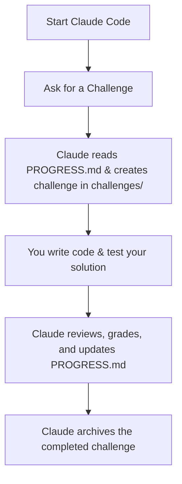

# 🎓 Coding Mentor

**Coding Mentor** is a self-directed coding practice framework powered by **Claude Code**. It operates as an automated mentor or a hackathon manager by analyzing your local repository, tracking your long-term progress, and dynamically generating coding challenges tailored specifically to your weaknesses and goals.

---

### ⚠️ Disclaimer


**Educational Purposes Only!** 
> This repository and its contents are provided strictly for educational, research, and informational purposes. 

---

## 💻 How to Use This Template

This repository is configured as a **GitHub Repository Template**. Do not fork or clone this repository directly if you want to start your own clean workspace.

1. Click the green **"Use this template"** button at the top of this page.
2. Select **"Create a new repository"**.
3. Choose your own repository name and visibility (Private/Public).
4. Clone *your new repository* to your local machine.

---

## 🛠️ Prerequisites

Before getting started, please make sure you have the following installed on your host machine:
* **Docker & Docker Compose** (To isolate and run your coding environments)
* **Claude Code** (Anthropic's command-line AI assistant)

---

## 🚀 Quick Start

You can run Claude Code either inside the isolated Docker container or directly from your host machine targeting this directory.

### 1. Spin up the Environment
```bash
# Build and start the container in the background
docker compose up -d --build

# Enter the container's interactive shell
docker compose exec mentor bash
```

### 2. Start a Session
Launch Claude Code within this repository directory:
```bash
claude
```
Once the CLI initializes, prompt your mentor to begin:
> *"Give me a new challenge based on my current track."*  
> OR  
> *"What should I work on today?"*

---

## 🏗️ How It Works

The framework relies on a predictable file structure that Claude Code reads and updates continuously to maintain state between your sessions:

```text
├── CLAUDE.md          # Global instructions guiding Claude to act as a mentor
├── PROGRESS.md        # The running ledger of skills practiced, strengths, and weaknesses
├── challenges/        # Active challenge workspace (one directory per challenge)
└── archive/           # Completed and reviewed challenges moved here for storage
```

### Component Breakdown
* **`CLAUDE.md`**: The brain of the setup. It contains the system prompt overrides instructing Claude Code how to behave, how to evaluate your code, and how to structure challenges.
* **`PROGRESS.md`**: The state machine. Claude dynamically updates this file after reviewing your submissions to log completed tasks, track metric scores, and highlight areas needing improvement.
* **`challenges/`**: Your active sandbox. Claude creates scoped project files here for you to solve.
* **`archive/`**: Your portfolio. Once a challenge is marked as complete and reviewed, Claude archives it to keep your active workspace clean.

---

## 🔄 Typical Workflow Loop



1. **Request:** Ask Claude for a tailored task.
2. **Execute:** Build your solution inside the generated `challenges/` subfolder.
3. **Review:** Ask Claude to evaluate your code against the challenge criteria.
4. **Iterate:** Address feedback until Claude approves the solution.
5. **Archive:** Claude updates `PROGRESS.md` and moves the workspace folder into `archive/`.

---

## 🤝 Contributing

Contributions are welcome to help expand the default project templates and mentoring heuristics! 

1. Fork the repository.
2. Create your feature branch (`git checkout -b feature/AmazingFeature`).
3. Commit your changes (`git commit -m 'Add some AmazingFeature'`).
4. Push to the branch (`git push origin feature/AmazingFeature`).
5. Open a Pull Request.

---

Happy learning :) 